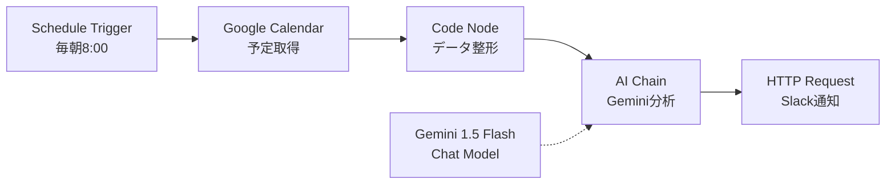
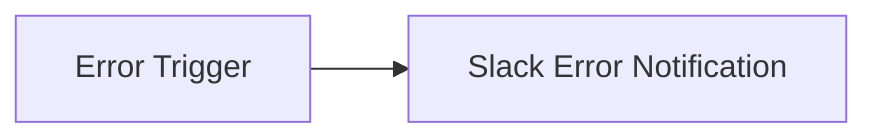

# n8n ワークフロー設計詳細

このドキュメントでは、Schedule Optimizer v0.1 の n8n ワークフローの詳細設計を解説します。

## ワークフロー概要



## ノード詳細設計

### 1. Schedule Trigger: 毎朝 8 時に実行

**ノードタイプ**: `n8n-nodes-base.scheduleTrigger`

**設定:**

- **Trigger Interval**: Cron Expression
- **Cron Expression**: `0 8 * * *`（毎日 8:00 AM）
- **Timezone**: `Asia/Tokyo`（環境変数 `GENERIC_TIMEZONE` から自動適用）

**役割:**

- 毎朝 8:00 にワークフローを自動実行するトリガー

**カスタマイズ例:**

```
0 9 * * *     # 毎朝9:00
0 8 * * 1-5   # 平日のみ8:00
0 8,14 * * *  # 毎日8:00と14:00の2回
```

---

### 2. Google Calendar: 今日の予定を取得

**ノードタイプ**: `n8n-nodes-base.googleCalendar`

**設定:**

- **Credential**: Google Calendar OAuth2 API
- **Resource**: Event
- **Operation**: Get Many
- **Calendar**: `primary`（メインカレンダー）
- **Return All**: `false`
- **Limit**: `50`

**Options（重要）:**
| オプション | 値 | 説明 |
|-----------|-----|------|
| `timeMin` | `={{ $now.startOf('day').toISO() }}` | 今日の 00:00 から |
| `timeMax` | `={{ $now.endOf('day').toISO() }}` | 今日の 23:59 まで |
| `orderBy` | `startTime` | 開始時刻順にソート |
| `singleEvents` | `true` | 繰り返し予定を個別イベントとして取得 |

**出力データ構造:**

```json
[
  {
    "summary": "チームミーティング",
    "start": {
      "dateTime": "2025-12-05T10:00:00+09:00"
    },
    "end": {
      "dateTime": "2025-12-05T11:00:00+09:00"
    },
    "location": "会議室A",
    "description": "週次進捗報告"
  }
]
```

**エラーハンドリング:**

- 予定が 0 件の場合も次のノードに空配列を渡し、後続ノードで「予定なし」として処理

---

### 3. Code Node: データ整形

**ノードタイプ**: `n8n-nodes-base.code`

**役割:**

- Google カレンダーの生 JSON を、Gemini が理解しやすいテキスト形式に変換
- 予定が 0 件の場合の特別処理

**処理ロジック:**

```javascript
const events = $input.all();

// 予定が0件の場合
if (events.length === 0) {
  return [
    {
      json: {
        eventsText: "今日は予定がありません。1日を自由に使えます。",
        eventCount: 0,
        rawEvents: [],
      },
    },
  ];
}

// イベントを整形
const formattedEvents = events.map((event) => ({
  summary: event.json.summary || "(タイトルなし)",
  start: event.json.start?.dateTime || event.json.start?.date,
  end: event.json.end?.dateTime || event.json.end?.date,
  location: event.json.location || "",
  description: event.json.description || "",
}));

// テキスト形式に変換
const eventsText = formattedEvents
  .map((e, i) => {
    const startTime = new Date(e.start).toLocaleTimeString("ja-JP", {
      hour: "2-digit",
      minute: "2-digit",
    });
    const endTime = new Date(e.end).toLocaleTimeString("ja-JP", {
      hour: "2-digit",
      minute: "2-digit",
    });

    return `${i + 1}. ${
      e.summary
    }\n   時間: ${startTime} - ${endTime}\n   場所: ${e.location || "なし"}`;
  })
  .join("\n\n");

return [
  {
    json: {
      eventsText: eventsText,
      eventCount: formattedEvents.length,
      rawEvents: formattedEvents,
    },
  },
];
```

**出力例:**

```json
{
  "eventsText": "1. チームミーティング\n   時間: 10:00 - 11:00\n   場所: 会議室A\n\n2. ランチMTG\n   時間: 12:00 - 13:00\n   場所: カフェテリア",
  "eventCount": 2,
  "rawEvents": [...]
}
```

---

### 4. Gemini Chat Model: AI 言語モデル

**ノードタイプ**: `@n8n/n8n-nodes-langchain.lmChatGoogleGemini`

**設定:**

- **Credential**: Google Gemini API（API キー）
- **Model**: `gemini-1.5-flash`
- **Temperature**: `0.7`（デフォルト）
- **Max Tokens**: デフォルト（約 2048）

**役割:**

- AI Chain ノードに接続され、言語モデルとして機能
- このノード単体では実行されず、AI Chain から呼び出される

**パラメータ調整:**
| パラメータ | 推奨値 | 効果 |
|-----------|--------|------|
| Temperature | `0.3` | より決定論的な出力（毎回似た提案） |
| Temperature | `0.7` | バランス重視（デフォルト） |
| Temperature | `1.0` | より創造的な提案（多様性重視） |
| Max Tokens | `1024` | 短い出力（コスト削減） |
| Max Tokens | `2048` | 詳細な出力 |

---

### 5. AI Chain: スケジュール分析

**ノードタイプ**: `@n8n/n8n-nodes-langchain.chainLlm`

**設定:**

- **Prompt Messages**: User Message（後述のプロンプトを設定）
- **Connect to**: Gemini 1.5 Flash（Chat Model ノード）

**プロンプト設計:**

```
あなたは私の優秀なAIアシスタント「ジャービス」です。
以下のGoogleカレンダーの予定データを確認し、今日のスケジュールを分析してください。

【今日の予定】
{{ $json.eventsText }}

【指示】
1. 今日の確定している予定を時系列で整理してください。
2. 予定と予定の間の「空き時間（ギャップ）」を見つけ出し、その時間が何分あるか明記してください。
   - 30分未満: 短い休憩に最適
   - 30分～1時間: 軽いタスクや準備に使える
   - 1時間以上: 集中作業が可能
3. その空き時間に、エンジニアとしてのタスク（コードレビュー、ドキュメント作成、技術記事の執筆、学習、休憩など）を適宜提案してください。
4. エンジニアである私に対し、簡潔かつモチベーションが上がるような口調（敬語）で「今日の作戦」を提案してください。

【出力形式】
Slackで読みやすいMarkdown形式で以下の構成でお願いします:

```

🌅 _今日の作戦 - {{ $now.toFormat('M月d日(ccc)') }}_

📅 _確定している予定_

- (時系列で予定をリスト)

⏰ _空き時間とおすすめタスク_

- (空き時間とタスク提案)

💡 _今日のアドバイス_
(一言アドバイス)

```

```

**プロンプトエンジニアリングのポイント:**

1. **ペルソナ設定**: 「ジャービス」という名前で親しみやすさを演出
2. **明確な指示**: 4 つの具体的なタスクを箇条書きで指示
3. **出力フォーマット指定**: Slack Markdown 形式を明示
4. **コンテキスト注入**: `{{ $json.eventsText }}` で前ノードのデータを渡す
5. **動的な日付**: `{{ $now.toFormat('M月d日(ccc)') }}` で今日の日付を挿入

**出力データ構造:**

```json
{
  "output": "🌅 *今日の作戦 - 12月5日(木)*\n\n📅 *確定している予定*\n- 10:00-11:00 チームミーティング\n- 12:00-13:00 ランチMTG\n\n⏰ *空き時間とおすすめタスク*\n- 9:00-10:00 (1時間): コードレビューに集中するのがおすすめです\n- 11:00-12:00 (1時間): ドキュメント作成や設計書の更新に使えます\n\n💡 *今日のアドバイス*\n午前中の空き時間を有効活用して、集中力が必要なタスクを終わらせましょう！"
}
```

---

### 6. HTTP Request: Slack に通知

**ノードタイプ**: `n8n-nodes-base.httpRequest`

**設定:**

- **Method**: `POST`
- **URL**: `={{ $env.SLACK_WEBHOOK_URL }}`（環境変数から取得）
- **Send Body**: `true`
- **Body Parameters**:
  ```json
  {
    "text": "={{ $json.output }}"
  }
  ```

**役割:**

- Gemini が生成した「今日の作戦」を Slack に投稿

**Slack Webhook URL の取得方法:**

1. [Slack Apps](https://api.slack.com/apps) にアクセス
2. 「Create New App」 → 「From scratch」
3. App Name: `Schedule Optimizer`, Workspace: 自分のワークスペース
4. 「Incoming Webhooks」 → 「Activate Incoming Webhooks」を ON
5. 「Add New Webhook to Workspace」 → 通知先チャンネルを選択
6. Webhook URL をコピーして `.env` の `SLACK_WEBHOOK_URL` に設定

**Slack での表示例:**

> 🌅 **今日の作戦 - 12 月 5 日(木)**
>
> 📅 **確定している予定**
>
> - 10:00-11:00 チームミーティング
> - 12:00-13:00 ランチ MTG
>
> ⏰ **空き時間とおすすめタスク**
>
> - 9:00-10:00 (1 時間): コードレビューに集中するのがおすすめです
> - 11:00-12:00 (1 時間): ドキュメント作成や設計書の更新に使えます
>
> 💡 **今日のアドバイス**
> 午前中の空き時間を有効活用して、集中力が必要なタスクを終わらせましょう！

---

## エラーハンドリング戦略

### 現在の実装（v0.1）

- ワークフローがエラーで停止した場合、n8n の実行履歴に記録される
- ユーザーは n8n 管理画面で確認可能

### 今後の拡張案（v0.2 以降）

#### 1. Error Trigger ノードの追加



**設定:**

- Error Trigger ノードで全ワークフローのエラーを検知
- Slack に「エラーが発生しました」と通知

#### 2. Retry ロジックの追加

Google Calendar API や Gemini API のレート制限エラー（429）が発生した場合、自動リトライ:

- **Wait** ノードで 30 秒待機
- **If** ノードでエラーコードをチェック
- 最大 3 回までリトライ

#### 3. Fallback メッセージ

Gemini API が使えない場合、シンプルな予定リストだけを Slack に通知:

```javascript
// Fallback用のCode Node
const events = $json.eventsText;
const fallbackMessage = `📅 今日の予定\n\n${events}\n\n（※ AI分析は現在利用できません）`;
return [{ json: { text: fallbackMessage } }];
```

---

## プロンプトのカスタマイズ例

### 1. より詳細な分析を求める

```
【指示】
1. 各予定の前後15分をバッファとして考慮してください。
2. 移動時間が必要な予定（場所が異なる予定の連続）を特定してください。
3. 1日のエネルギーレベルを考慮し、午前は集中作業、午後は軽作業を提案してください。
```

### 2. タスク管理ツールとの連携を想定

```
【出力形式】
以下のJSON形式で出力してください:
{
  "summary": "今日の予定サマリー",
  "gaps": [
    {
      "startTime": "09:00",
      "endTime": "10:00",
      "durationMinutes": 60,
      "suggestedTask": "コードレビュー"
    }
  ],
  "advice": "一言アドバイス"
}
```

### 3. 週間レポート版

```
【指示】
過去1週間の予定データを分析し、以下を報告してください:
1. 最も会議が多かった曜日
2. 平均的な空き時間の長さ
3. 来週に向けた改善提案
```

---

## パフォーマンス最適化

### トークン使用量の削減

1. **不要なフィールドを削除**:
   - `description`（詳細説明）が長い場合、最初の 100 文字だけ渡す
2. **プロンプトの簡潔化**:

   - 出力例を削除し、フォーマット指示だけにする

3. **モデルの変更**:
   - `gemini-1.5-flash` → `gemini-1.0-pro`（より軽量）

### 実行時間の短縮

1. **並列実行**:

   - 複数のカレンダーを取得する場合、並列ノードで同時取得

2. **キャッシング**:
   - n8n の「Static Data」機能で、1 日分のデータを保存
   - 2 回目以降の手動実行時はキャッシュから読み込み

---

## 次のステップ

1. **ワークフローのインポート**: `n8n/workflows/schedule-optimizer-v0.1.json` を n8n にインポート
2. **クレデンシャル設定**: 各ノードで認証情報を設定
3. **手動テスト**: 「Execute Workflow」ボタンで動作確認
4. **プロンプト調整**: 出力結果を見ながらプロンプトをチューニング
5. **本番運用**: Schedule Trigger を有効化して毎朝自動実行

詳細な実装手順は [README.md](../README.md) を参照してください。
