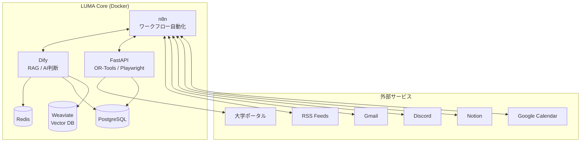
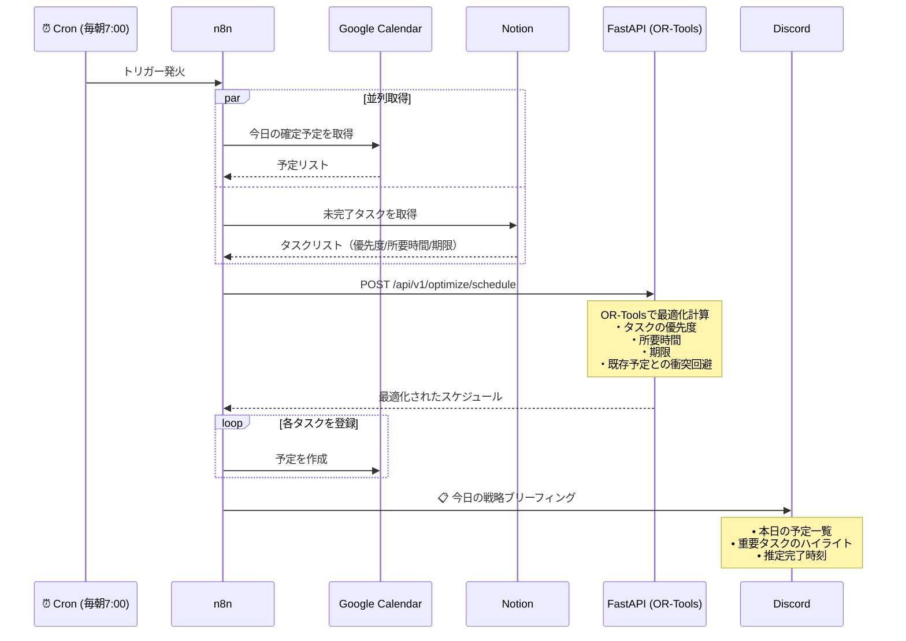
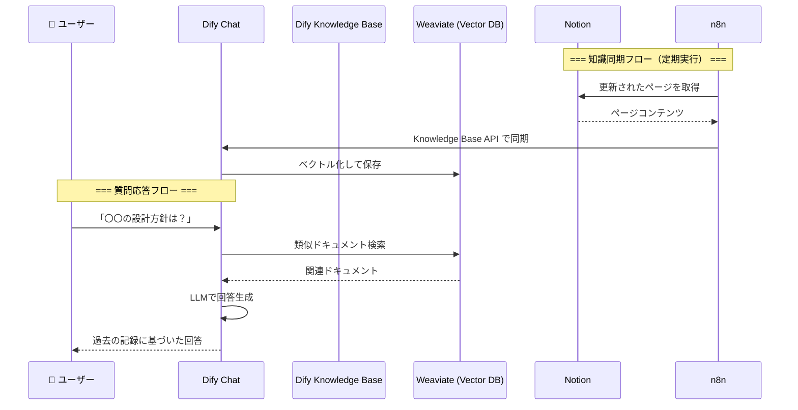
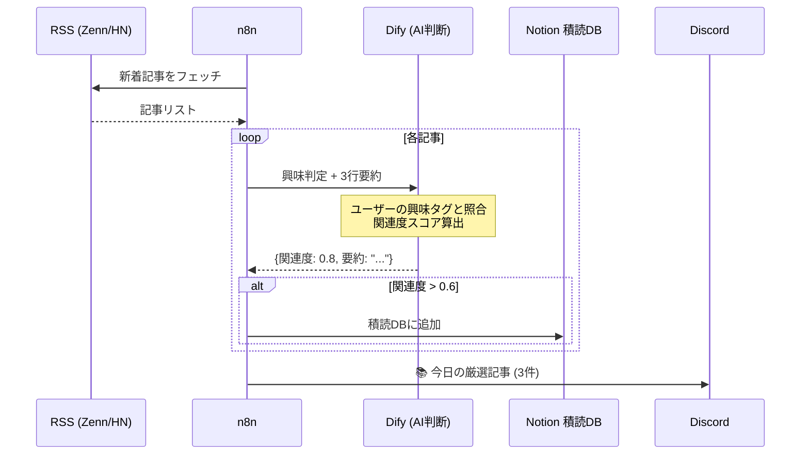
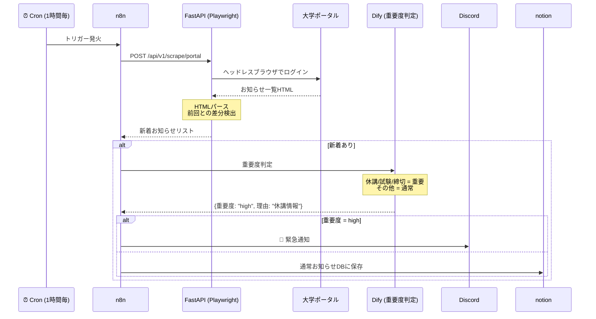
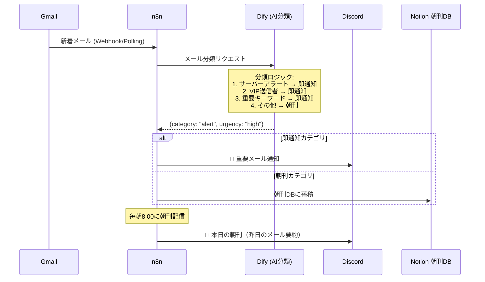

# Project LUMA: システムフロー図

## 全体アーキテクチャ



---

## Phase 1: The Scheduler（数理的スケジュール最適化）

### 概要

毎朝自動で最適なスケジュールを計算し、カレンダーに登録して Discord で通知。

### フロー図



### n8n ワークフロー構成

```
[Schedule Trigger: 毎朝7:00]
    ↓
[HTTP Request: GCal API - 今日の予定取得]
    ↓
[HTTP Request: Notion API - 未完了タスク取得]
    ↓
[Merge: データ統合]
    ↓
[HTTP Request: FastAPI /optimize/schedule]
    ↓
[Loop: 最適化結果をGCalに登録]
    ↓
[Discord: ブリーフィング送信]
```

### FastAPI エンドポイント

```
POST /api/v1/optimize/schedule

Request:
{
  "fixed_events": [...],      // GCalから取得した確定予定
  "tasks": [                  // Notionから取得したタスク
    {
      "id": "task-1",
      "title": "設計レビュー",
      "priority": 1,          // 1=高, 2=中, 3=低
      "duration_minutes": 60,
      "deadline": "2024-12-12T18:00:00"
    }
  ],
  "work_start": "09:00",
  "work_end": "22:00"
}

Response:
{
  "schedule": [
    {
      "task_id": "task-1",
      "start": "2024-12-12T09:00:00",
      "end": "2024-12-12T10:00:00"
    }
  ],
  "unscheduled": [],          // スケジュールできなかったタスク
  "summary": "5件のタスクを配置しました"
}
```

---

## Phase 2: The Knowledge Brain（知識統合と RAG）

### 概要

Notion の技術メモ・設計書を知識ベースに同期し、チャットで質問できるようにする。

### フロー図



### RSS 収集・要約フロー



---

## Phase 3: Real World Interface（情報収集と通知）

### 大学ポータル監視フロー



### スマート・インボックス（メール監視）フロー



---

## API エンドポイント一覧

### FastAPI (localhost:8001)

| エンドポイント              | メソッド | 機能                       |
| --------------------------- | -------- | -------------------------- |
| `/api/v1/optimize/schedule` | POST     | スケジュール最適化         |
| `/api/v1/scrape/portal`     | POST     | 大学ポータルスクレイピング |
| `/health`                   | GET      | ヘルスチェック             |

### Dify (localhost:80)

| 機能           | 用途                             |
| -------------- | -------------------------------- |
| Knowledge Base | Notion 同期、RAG 検索            |
| Workflow       | 記事要約、メール分類、重要度判定 |
| Chat App       | 知識ベースへの質問応答           |

### n8n (localhost:5678)

| ワークフロー      | トリガー       | 機能               |
| ----------------- | -------------- | ------------------ |
| Morning Scheduler | Cron 7:00      | スケジュール最適化 |
| RSS Collector     | Cron 6:00      | 技術記事収集       |
| Portal Monitor    | Cron 毎時      | 大学ポータル監視   |
| Email Inbox       | Polling 5 分毎 | メール監視         |
| Morning Briefing  | Cron 8:00      | 朝刊配信           |

---

## 環境変数（.env に追加が必要）

```bash
# Google Calendar
GOOGLE_CLIENT_ID=
GOOGLE_CLIENT_SECRET=
GOOGLE_REFRESH_TOKEN=

# Notion
NOTION_API_KEY=
NOTION_TASK_DATABASE_ID=
NOTION_READING_DATABASE_ID=

# Discord
DISCORD_WEBHOOK_URL=

# Gmail
GMAIL_CLIENT_ID=
GMAIL_CLIENT_SECRET=

# 大学ポータル
PORTAL_URL=
PORTAL_USERNAME=
PORTAL_PASSWORD=
```
